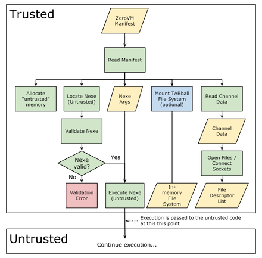
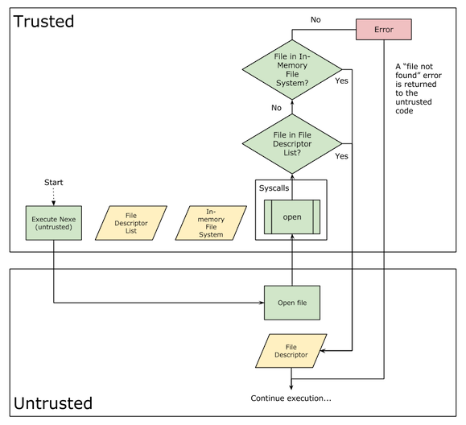
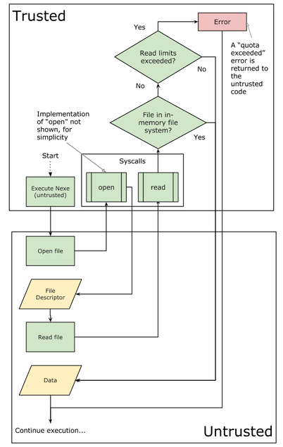

.. _zerovm-application-execution:

Application Execution
=====================

When ZeroVM begins execution, here is a simplified stripped-down version
of what happens:

- ZeroVM reads the input manifest file
- Once the manifest is read, the following things happen (the order is not
  important):

  - The nexe (the cross-compiled program to execute) is located and validated
  - Memory is allocated for the "untrusted" code
  - Nexe arguments are read from manifest
  - Channel data is read from the manifest and held in memory
  - TARball images are attached to the in-memory file system (optional)

- Pass execution to the untrusted code

System Call Detail
------------------

Below are some examples of how ZeroVM handles files/channels and I/O
internally.

Example 1: Opening a file
+++++++++++++++++++++++++

When a user (untrusted) program attempts to open a file, the following will
happen:

- Execute the ``open`` syscall, passing execution to the trusted code

  - If the target file exists in the list of manifest channels, return a file
    descriptor to the untrusted code
  - If the target file is not in the list of channels, but exists in the
    in-memory file system, return a file descriptor to the untrusted code
  - If neither of the above cases applies, return a "file not found" error

Example 2: Reading from a file
++++++++++++++++++++++++++++++

Given a file descriptor, here is what happens when an untrusted program
attempts to read from a file:

- Execute the ``read`` syscall, passing execution to the trusted code

  - If the target file is in the in-memory file system, perform the read
  - If the target file is not in the in-memory file system, check if the
    read limits for the file have been exceeded

    - If so, return a "quota exceeded error"
    - Otherwise, perform the read

More or less the same logic applies to writing to a file.

